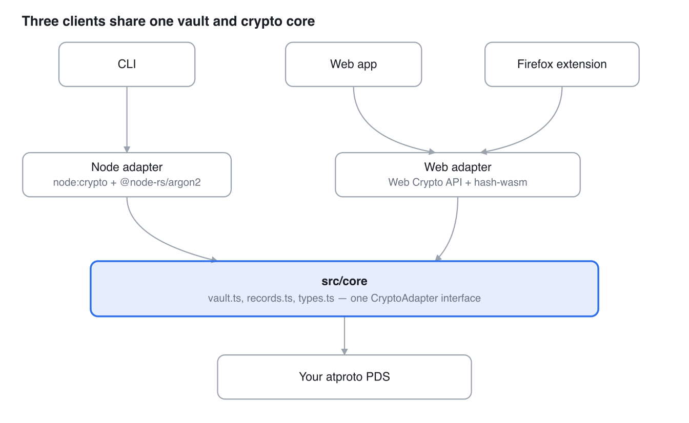

# atpass Design Doc

Oct 5, 2026 · @Neil

## Overview

atpass stores vault items as end-to-end encrypted records inside the user's own [atproto](https://atproto.com) (Bluesky) PDS repo, instead of on a vendor's server — the PDS operator, and anyone who reads the public repo, sees ciphertext only.

- **Core idea**: reuse atproto's existing repo storage, DID-based identity, and sync instead of building a backend. A vault is two record collections, `xyz.atpass.vault.meta` and `xyz.atpass.vault.item`, living in the same repo as the user's other atproto data.
- **Three clients, one core**: a CLI, a web app, and a Firefox extension all sit on `src/core`, a shared vault/crypto library with pluggable Node and browser backends. They're wire-compatible — an item added from the CLI decrypts correctly in the web app or the extension, and vice versa.
- **Status**: this is a testbed for exploring atproto as a storage substrate, built end-to-end with Claude — not a vetted password manager. It has an automated test suite and a release pipeline, but no independent security audit. See [github.com/neilcar/atpass](https://github.com/neilcar/atpass).

## Goals and non-goals

**Goals**

- Store vault items so that only the holder of the master password can read them — the PDS, the network, and anyone reading the public repo see ciphertext and record counts, nothing else.
- Let the CLI, web app, and extension read and write the *same* vault interchangeably, with no server of our own in the loop.
- Keep the master password fully independent of the atproto account login (App Password), so compromising one doesn't compromise the other.
- Minimize permissions and attack surface per client — e.g. the extension asks for `activeTab` + `scripting`, not a content script on every page.

**Non-goals (for now)**

- atproto OAuth. All three clients authenticate with handle + App Password; OAuth (PAR, DPoP, client metadata hosting) is real work that hasn't been done.
- Mobile clients, browsers other than Firefox, or syncing/caching a local copy of the vault for offline use.
- Publishing the `xyz.atpass.*` lexicons as a registered namespace — they're a personal placeholder today.

## Architecture

atpass is three thin clients on one shared core: the CLI, the web app, and the Firefox extension each implement only session management and a `CryptoAdapter` (Node or browser crypto), while `src/core`'s vault logic and atproto record format stay identical across all three.



*architecture · 3 clients, 2 crypto adapters, 1 core*

Both adapters implement the same `CryptoAdapter` interface — key derivation, AES-GCM encrypt/decrypt, record-key hashing — so `src/core` never changes behavior based on which client is running it. That's what makes a vault item written by one client readable by another.

## Data model

Each vault lives in two record collections in the user's own atproto repo — see [`lexicons/`](https://github.com/neilcar/atpass/tree/main/lexicons) for the full schemas.

| Collection | Record key | Fields | Purpose |
| --- | --- | --- | --- |
| `xyz.atpass.vault.meta` | literal `self` (one per account) | `kdf`, `salt`, `kdfParams`, `verifier`, `verifierIv`, `createdAt` | Argon2id parameters + an encrypted check value, so a client can verify the master password before touching real data |
| `xyz.atpass.vault.item` | Random 128-bit value as hex | `alg`, `iv`, `ciphertext`, `createdAt`, `updatedAt` | One vault entry; `ciphertext` is the whole item — title, username, password, url, notes — encrypted together as one JSON blob |

**Why a random record key**: earlier versions used `sha256(lowercase title)`, which made "get the item named X" a single `getRecord`, but let anyone reading the public repo test guesses ("is there a record for github.com?"). Keys are now random, so a lookup by title lists and decrypts the vault's items locally. Unlocking a vault moves any items still under title-hash keys to random keys: each batch re-encrypts the items (the key is bound in as AAD) and creates the new records and deletes the old ones in one `applyWrites` commit, so nothing is lost or duplicated if it's interrupted. Random keys have the same shape as the old hashes, so the repo doesn't show which items have moved. Records already published under hash keys may survive in copies of the repo made before the move, and anyone watching the repo while it happens can link each old key to its new one.

**Why AAD-bound ciphertext**: AES-GCM's additional authenticated data on every item is its own record path, `xyz.atpass.vault.item/<rkey>`. That ties each ciphertext to the specific record it lives in: swapping one item's ciphertext into another item's record (e.g. a malicious PDS operator trying to confuse which password belongs to which site) fails to decrypt, because the AAD won't match. [`test/crypto.test.ts`](https://github.com/neilcar/atpass/blob/main/test/crypto.test.ts) asserts this directly.

## Security and threat model

The master password is run through Argon2id (128 MiB memory, 5 iterations, parallelism 2 for new vaults; vaults created earlier keep their stored 64 MiB / 3 / 1, which is still the enforced floor) with a per-account random 32-byte salt (16 bytes for older vaults), producing a 256-bit key. Each item is encrypted individually with AES-256-GCM: a random 12-byte nonce per item, plus the AAD binding from the data model section above.

**Protected against**

- A malicious or compromised PDS operator, or anyone reading the public repo: they see only that an account has some number of vault items and roughly when they changed — never titles, usernames, passwords, URLs, or notes.
- A wrong master password: rejected via the `meta` record's verifier, without ever deriving a key that could decrypt real item data.
- A network failure mid-operation: nothing is cached locally, so there's no local state to leave half-written.

**Not protected against**

- A reused or breached master password — new vaults reject guessable passwords (zxcvbn score below 3, checked locally in `initVault`), but there's no breach-list check, and vaults created before that check aren't re-tested.
- A compromised local machine while the vault is unlocked (keylogger, malware reading process memory, a malicious browser extension sharing the page).
- Theft of the atproto session token itself (see below) — it's a bearer credential for the whole repo, not scoped to the vault.

**Session token storage per client** — each client caches the atproto session so you don't re-authenticate every command; this token is NOT the master password and can't decrypt anything, but it can read/write the account's whole atproto repo (whatever the App Password grants):

| Client | Storage | Isolation |
| --- | --- | --- |
| CLI | OS keyring (Keychain / Credential Manager / Secret Service); `~/.atpass/session.json` only when no keyring is available | Keyring's per-user protection; the fallback file relies on permissions (`chmod 600`) and the CLI warns when it's used |
| Web app | `sessionStorage` (per tab, cleared when it closes) | None from same-origin JS — readable by an XSS bug (the CSP limits script to the app's own origin) or a rogue browser extension |
| Firefox extension | `browser.storage.local` | Extension sandbox — not reachable from page JavaScript at all |

**Why the master password is independent of the atproto login**: an App Password lets someone read/write the account's whole repo; the master password is the only thing that can decrypt vault contents. A leaked App Password lets an attacker see ciphertext and delete records — not read a single password. Neither secret, alone, compromises the other.

## Cross-platform crypto compatibility

`CryptoAdapter` (`src/core/types.ts`) is the seam between platform-agnostic vault logic and platform-specific crypto:

```typescript
interface CryptoAdapter {
  newSalt(): Uint8Array;
  deriveVaultKey(password: string, salt: Uint8Array, params: KdfParams): Promise<Uint8Array>;
  encryptItem(key: Uint8Array, payload: unknown, aad: string): Promise<EncryptedBlob>;
  decryptItem<T>(key: Uint8Array, iv: string, ciphertext: string, aad: string): Promise<T>;
  makeVerifier(key: Uint8Array): Promise<EncryptedBlob>;
  checkVerifier(key: Uint8Array, iv: string, ciphertext: string): Promise<boolean>;
  newRecordKey(): string;
  rkeyForName(name: string): Promise<string>; // legacy title-hash key, only to recognize items to migrate
  generatePassword(opts?: GeneratePasswordOptions): string;
}
```

Two implementations satisfy it: `src/core/node/crypto.ts` (`node:crypto` for AES-256-GCM + `@node-rs/argon2`, a native Rust binding, for Argon2id) and `src/core/web/crypto.ts` (the Web Crypto API's `crypto.subtle` for AES-GCM + `hash-wasm`'s WASM build of Argon2id). Since a vault item encrypted on one client has to decrypt on another, both implementations must agree byte-for-byte on the Argon2id derivation and the AES-GCM wire format — that's a correctness requirement, not just an interface match.

**How it's verified**: [`test/cross-platform-crypto.test.ts`](https://github.com/neilcar/atpass/blob/main/test/cross-platform-crypto.test.ts) runs both adapters side by side, in Node — which happens to support `node:crypto`, the standard Web Crypto API, and `hash-wasm`'s WASM module all natively, so the real browser adapter code is exercised directly in CI without needing an actual browser. It asserts same password+salt+params → byte-identical derived key from both adapters; an item encrypted by the Node adapter decrypts correctly with the Web adapter's key (and vice versa); and the `meta` verifier and `rkeyForName` hash agree across adapters too.

**A wrinkle this surfaced**: Node's `createCipheriv`/`createDecipheriv` return the GCM authentication tag separately (via `getAuthTag()`), while the Web Crypto API's `crypto.subtle.encrypt` appends it to the ciphertext. Both `crypto.ts` implementations normalize to the Web Crypto convention (tag appended), so the `ciphertext` field stored in an atproto record has one unambiguous format no matter which client wrote it.

## Client-specific design notes

### Web app

- Vite + React, genuinely client-only — no server component at all. The [Docker image](#releasing) just serves the built static files via nginx; there's nothing to configure or trust beyond the PDS itself.
- Talks to the PDS directly from the browser via `com.atproto.server.createSession` (the same CORS-friendly XRPC calls the CLI makes), relying on the PDS's own CORS headers rather than any proxy of ours.
- The vault key lives in a React state variable scoped to the tab; closing the tab or clicking Lock clears it. It's never written to browser storage — only the atproto session token is, in the tab's `sessionStorage`.

### Firefox extension

- Manifest V3: a background script (a non-persistent event page) plus a small React popup. No content script is declared in the manifest at all — `browser.scripting.executeScript` injects a one-off function into the active tab only when the user clicks something, under the `activeTab` permission model, rather than running on every page the user visits.
- The popup never touches vault or crypto code directly. Every operation — status, login, unlock, list, save, delete, fill — is a typed message (`src/lib/messages.ts`) round-tripped through `browser.runtime.sendMessage` to the background script, which is the only place the decrypted vault key and the atproto agent live.


*fill sequence · popup → background → active tab*

- Trade-off: Firefox can suspend an idle background script, which drops the in-memory vault key — the user has to unlock again. That's treated as correct behavior (a secret shouldn't outlive the process that needs it) rather than a bug to engineer around.

## CI/CD and release pipeline

[`.github/workflows/release.yml`](https://github.com/neilcar/atpass/blob/main/.github/workflows/release.yml) is one workflow with five jobs: three run on every push/PR to `main`, two are tag-gated and depend on `test` passing first.

| Job | Runs on | Purpose |
| --- | --- | --- |
| `test` | every push/PR + tags · matrix: ubuntu/macos/windows | Build the CLI, run the test suite, sanity-check `--version`/`--help` — cross-platform because `@node-rs/argon2` ships native bindings and `clipboardy` shells out to a different backend per OS |
| `extension-build-check` | every push/PR | Build + `web-ext lint` the extension, so a break surfaces before a release tag, not at release time |
| `docker-build-check` | every push/PR | Build `web/Dockerfile`, no push, no credentials needed — same reason |
| `release` (needs `test`) | tag `v*.*.*` | Verify the tag matches `package.json`'s version, pack the CLI, sync + build + package the extension, attach both to a new GitHub Release |
| `docker` (needs `test`) | tag `v*.*.*` | Build + push `web/Dockerfile` to Docker Hub as `<DOCKERHUB_USERNAME>/atpass-web`, `linux/amd64` + `linux/arm64`, tagged with the version and `latest` |

**One version number, three artifacts**: the CLI's `--version` reads from `package.json` at runtime (it used to be a hardcoded string that could silently drift from what was actually tagged); `scripts/sync-extension-version.mjs` stamps the extension's manifest with the same number right before packaging. One `npm version patch/minor/major` plus a `vX.Y.Z` tag keeps the CLI tarball, extension zip, and Docker image labeled consistently.

**A real bug this caught**: `npm pack` follows `.gitignore` by default, which was silently excluding `dist/` — the first release tarball would have installed but had no working `bin` entry point. Fixed with an explicit `files` allowlist in `package.json`, caught by actually packing it and running `npm install -g` on the tarball before trusting the workflow.

**A real CI failure, not a hypothetical one**: the first `npm test` run in GitHub Actions failed with "Could not find test/\*\*/\*.test.ts" — the `**` glob had only ever worked locally by accident. Bash (GitHub Actions' default shell for `run:` steps) doesn't expand `**` without `shopt -s globstar`, and the Windows runner's PowerShell doesn't glob-expand arguments for external commands the way bash does either. `scripts/run-tests.mjs` now finds test files itself via `fs.readdirSync` and runs `node --import tsx --test` directly, so discovery no longer depends on shell behavior at all.

## Known limitations and future work

- **No independent security audit.** The crypto design (Argon2id + AES-256-GCM, AAD-bound ciphertexts, a master password kept separate from the atproto login) follows established patterns, but nobody outside this project has reviewed it — see the testbed warning at the top of the README.
- **atproto OAuth isn't implemented.** All three clients use handle + App Password, so the PDS sees the App Password at sign-in. OAuth (PAR, DPoP, hosted client metadata) would avoid that, at the cost of real additional implementation work.
- **Publishing is wired up but off by default.** `npm publish` and AMO submission would take one `package.json` field and a couple of secrets each (see the comments in `release.yml` and `extension/README.md`) — deliberately not done yet, not an oversight.
- **The `xyz.atpass.*` lexicon namespace is an unregistered placeholder**, not a domain anyone owns. Fine for personal use; should be renamed before the lexicons are published more broadly.
- **No in-page autofill affordance.** The extension requires opening the popup and clicking an item — it doesn't detect login forms while browsing, offer an inline fill icon, or look inside iframes or shadow DOM for a password field. Deliberately minimal (nothing runs until the user acts), but less convenient than a full password-manager extension.
- **No local caching or offline mode**, for any client. Every read/write is a live round trip to the PDS — simpler, and there's no local state to go stale or leak, but no vault access without network connectivity.
- **The web app's JS bundle is large** (\~960 KB, mostly `@atproto/api`), flagged by Vite's build output. Not yet worth the complexity of code-splitting for a single-page app this size.
